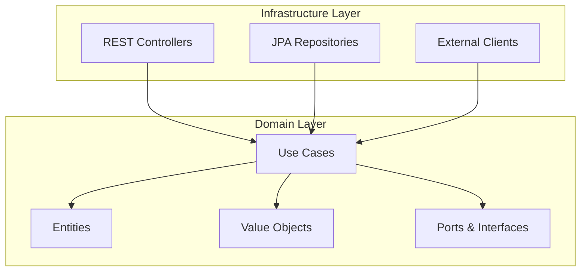

# YNAB Syncher Documentation

Welcome to the comprehensive documentation for YNAB Syncher - a robust transaction reconciliation service built with Hexagonal Architecture.

## 📋 **Table of Contents**

### 🏗️ **Architecture**
- [Architecture Overview](architecture/overview.md)
- [Hexagonal Architecture Pattern](architecture/hexagonal.md)
- [Domain-Driven Design](architecture/ddd.md)
- [Testing Strategy](architecture/testing.md)

### 📖 **API Documentation**
- [REST API Reference](api/rest-api.md)
- [Domain API](api/domain-api.md)
- [Integration Examples](api/examples.md)

### 🚀 **Deployment**
- [Local Development Setup](deployment/local-setup.md)
- [Docker Deployment](deployment/docker.md)
- [Production Deployment](deployment/production.md)
- [Configuration Guide](deployment/configuration.md)

### 🔧 **Development**
- [Contributing Guidelines](../CONTRIBUTING.md)
- [Coding Standards](development/coding-standards.md)
- [Architecture Decision Records](adr/)
- [Release Process](development/release-process.md)

### 📊 **Quality Reports**
- [Test Coverage](coverage/) - Generated automatically
- [Mutation Testing](mutation-testing/) - Generated automatically
- [JavaDoc](javadoc/) - Generated automatically

## 🎯 **Quick Links**

- [GitHub Repository](https://github.com/emirfredy/ynab-syncher)
- [Latest Release](https://github.com/emirfredy/ynab-syncher/releases/latest)
- [Issue Tracker](https://github.com/emirfredy/ynab-syncher/issues)
- [Discussions](https://github.com/emirfredy/ynab-syncher/discussions)

## 🏛️ **Architecture Overview**

YNAB Syncher follows the Hexagonal Architecture pattern (also known as Ports and Adapters), ensuring clean separation of concerns and high testability.



## 📊 **Quality Metrics**

This project maintains exceptional quality standards:

| Metric | Current | Target | Status |
|--------|---------|--------|---------|
| Line Coverage | 96% | >90% | ✅ Excellent |
| Mutation Coverage | 94% | >70% | ✅ Exceptional |
| Architecture Tests | 12 | All Pass | ✅ Compliant |
| Total Tests | 175 | >100 | ✅ Comprehensive |

## 🚀 **Getting Started**

1. **Clone the repository**
   ```bash
   git clone https://github.com/emirfredy/ynab-syncher.git
   cd ynab-syncher
   ```

2. **Run tests**
   ```bash
   ./mvnw clean verify
   ```

3. **Start application**
   ```bash
   ./mvnw -pl infrastructure spring-boot:run
   ```

## 📝 **Documentation Generation**

This documentation is automatically generated and deployed via GitHub Actions:

- **Source**: Markdown files in `/docs`
- **Generated Reports**: Test coverage, mutation testing, JavaDoc
- **Deployment**: GitHub Pages
- **URL**: https://emirfredy.github.io/ynab-syncher

---

*Last updated: Generated automatically on each release*